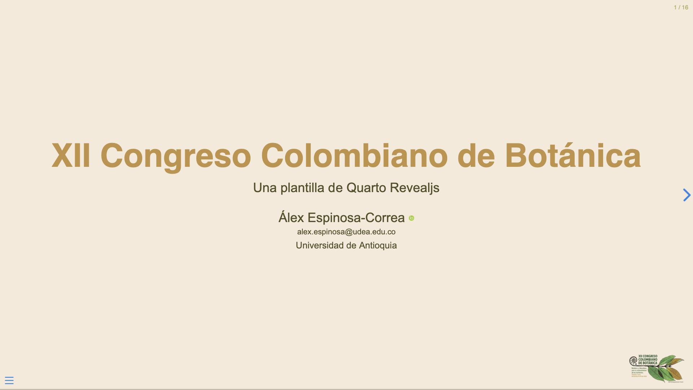

# Quarto Revealjs XII Congrego Colombiano de Botánica theme

Una extensión de [Quarto](https://quarto.org) para crear presentaciones Reveal.js para el [XII Congreso Colombiano de Botánica](http://congresobotanica.org) hecha por [Álex Espinosa-Correa](https://alexespinosaco.github.io) basada en la [presentación sugerida](https://congresobotanica.org/wp-content/uploads/2024/10/5.-QUINTA-Circular-XII-CCB-UNICAUCA-1.pdf) por los organizadores.



## Instalación

### En un proyecto nuevo

En la terminal ejecute:

```bash
quarto use template alexespinosaco/quarto-revealjs-xii-ccb
```

Esto instalará la extensión y creará varios archivos: 
-  `_extesion`: carpeta donde se instala la extesión.
-  `*.qmd`: archivo que puede utilizar como punto de partida para su presentación.
-  `*.Rproj`: archivo de configuración de los proyectos de RStudio. 
-  `apa.csl`: archivo `.csl` del formato de citación APA.
-  `references.bib`: archivo `bib` que contiene una referencia.


#### ¡Importante!

Si está usando el `*.qmd` proporcionado como ejemplo, para el correcto renderizado de este, es **muy importante** que dentro de la carpeta `_extesion` mueva la carpeta `xii-ccb` fuera de la carpeta `alexespinosaco`.

Así mismo, es importante que cuente con los archivos `apa.csl` y `references.bib`. Estos pueden eliminarse si no va a utilizar citas.

### En un proyecto existente

Desde el directorio del proyecto o documento Quarto, ejecute el siguiente comando:

```bash
quarto add alexespinosaco/quarto-revealjs-xii-ccb
```

Este formato puede ser utilizado con un proyecto o documento Quarto existente. Esto instalará sólo los archivos en la carpeta `_extension` y no instalará los archivos por encima de eso (los archivos de demostración). Esta es también la forma de actualizar la extensión si ha habido cambios.

Ahora puede usar `xii-ccb-revealjs` como formato:

```yml
---
title: "XII Congreso Colombiano de Botánica"
author: "Álex Espinosa-Correa"
format: xii-ccb-revealjs
---
````

## Más información

-  [Introducción a Quarto](https://quarto.org/)
-  [Grupo de Estudios Botánicos GEOBOTA](http://geobota.github.io/)
-  [Guía de Quarto para formatos personalizados](https://quarto.org/docs/extensions/formats.html)
-  [Guía de Quarto para presentaciones en Revealjs](https://quarto.org/docs/presentations/revealjs/)
-  [XII Congreso Colombiano de Botánica](http://congresobotanica.org)
